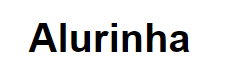
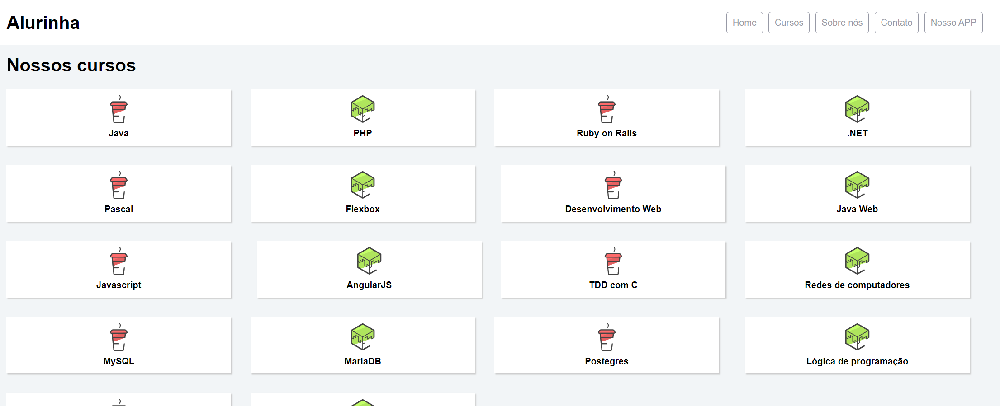
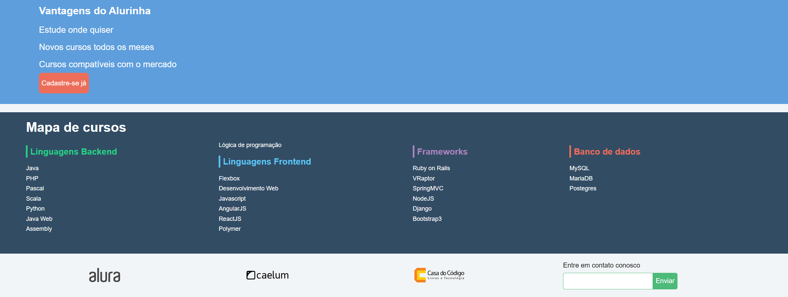

# Alurinha
## Página criada utilizando o modelo da página da Alura.
<h1 align="center">
  
</h1>

 <a href="#sobre-o-projeto">Sobre</a> •
 <a href="#funcionalidades">Funcionalidades</a> •
 <a href="#layout">Layout</a> • 
 <a href="#tecnologias">Tecnologias</a> • 

<h4 align="center"> 
	 Alura Finalizado
</h4>

## Sobre o projeto

Alurinha foi um projeto desenvolvido durante a formação de front-end.

Esse projeto foi desenvolvido para o estudo de implementação de conceitos básicos e boas práticas adotados na utilização do html, css e javaScript. No que diz respeito a resposividade para diversas tamanhos de tela.

## ⚙Funcionalidades

-Basicamente o projeto consiste de apenas uma página principal pois o fim é apenas didático e introdutório a responsividade:

  Página Index:
  
  Nesta página está localizada as informações principais ao site dividio em três seções sendo elas o cabeçalho, uma galeria de cursos disponiveis e no final um rodapé
  
  <h3>Página visualidada de um desktop:</h3>
  
  
  ---
  
  
  ---   

## 🎨Layout

O layout foi fornecido pela Alura 
[Alura](https://www.alura.com.br/).

### 🛠Tecnologias

As seguintes ferramentas foram usadas na construção do projeto:

- [HTML](https://www.w3schools.com/html/default.asp)
- [CSS](https://www.w3schools.com/css/)
- [VisualStudio](https://visualstudio.microsoft.com/pt-br/)
